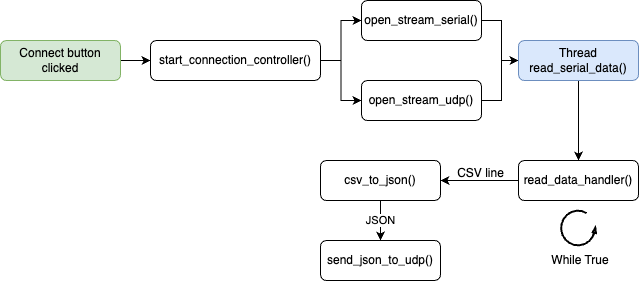

# Serial-to-JSON-UDP-translator
Real time **Serial CSV** to **UDP JSON** stream translator

<!-- ## General schema
 -->

## How to use
### Install dependencies
```bash
pip install -r requirements.txt
```

### CONFIG file
To configure the parameters of the program you have to create a 'CONFIG.txt' file with the following parameters:
```txt
VALUES=PARAM1, PARAM2, NULL, PARAM3
NEWLINE=\n
SEPARATOR=,
BAUDRATE=9600
UDP_PORT=5000
SERIAL_PORT=/dev/ttyUSB0
```
The 'VALUES' params indicate the order of the values in the CSV string. The 'NULL' value indicates that the value is not going to be sent. The 'NEWLINE' param indicates the character that separates the CSV strings. The 'SEPARATOR' param indicates the character that separates the values in the CSV string. The 'BAUDRATE' param indicates the baudrate of the serial port. The 'UDP_PORT' param indicates the port of the UDP server. The 'SERIAL_PORT' param indicates the serial port to use.

With this configuration you can send the following JSON (assuming CSV data is: 1,2,3,4\n):
```json
{
    "PARAM1": 1,
    "PARAM2": 2,
    "PARAM3": 4
}
```

...

### Build executable
```bash
pyinstaller --name SerialToUdpTranslator  main.py --onefile --windowed
```

## Tech stack
- Python 3.12.2
- [Tkinter](https://docs.python.org/3/library/tkinter.html)
