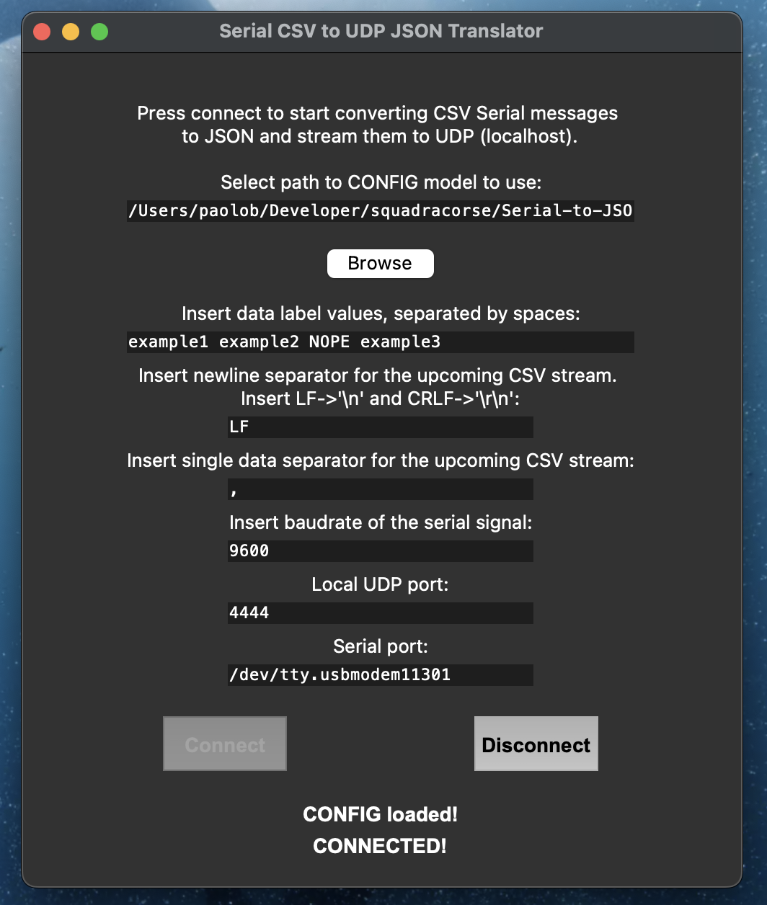
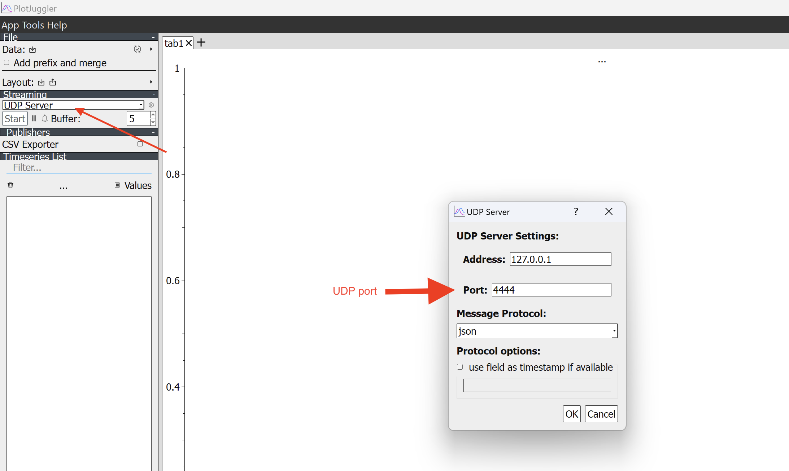

# Serial-to-JSON-UDP-translator
Real time **Serial CSV** to **UDP JSON** stream translator.

The executables can be found in the **Releases** section.

## App


## General logical schema


## How to use
### Install dependencies
```bash
pip install -r requirements.txt
```

### CONFIG file
To configure the parameters of the program you have to create a `CONFIG.txt` file with the following parameters:
```txt
VALUES=PARAM1,PARAM2,NULL,PARAM3
NEWLINE=;
SEPARATOR=,
BAUDRATE=9600
UDP_PORT=5000
SERIAL_PORT=/dev/ttyUSB0
```
The `VALUES` params must be separated by the `SEPARATOR` character, they indicate the order of the values in the CSV string (note that spaces will be replaced with "_"). The NULL value indicates that the value is not going to be sent, but discarded when the CSV comes into the program. The `NEWLINE` param indicates the character that separates the CSV strings, the usage of '\n' as a NEWLINE can be achieved via the 'LF' symbol and the '\r\n' via the 'CRLF' one (ex: NEWLINE=LF). The `SEPARATOR` param indicates the character that separates the values in the CSV string. The `BAUDRATE` param indicates the baudrate of the serial port. The `UDP_PORT` param indicates the port of the UDP server. The `SERIAL_PORT` param indicates the serial port to use.

With the configuration shown above you can send the following JSON (assuming CSV data is: 1,2,3,4\n):
```json
{
    "PARAM1": 1,
    "PARAM2": 2,
    "PARAM3": 4
}
```

### Command-line run option
It is possible to run the program directly from the command line (for example) with the following command:
```bash
./SerialToUdpTranslator-v2.8.2-Win-x64.exe --config ./CONFIG.txt --nogui
#./NameOfTheExecutable -config ./CONFIG.txt --nogui
```
Where you can specify the path of the configuration file `--config` -> `CONFIG.txt` file (explained above) and the `--nogui` flag to run the program without the GUI.

## How to pair with Plotjuggler graphing tool
1. Open Plotjuggler
2. Click on the `Streaming` section, select UDP Server:

3. Set the port to the same number as UDP_PORT of the CONFIG and click on 'Ok'.
4. Click on the 'Start' button and select the parameters you want to plot from the menu on the left.
5. Drag the data values in the graph area to visualize them.

## Build executable
```bash
pyinstaller --name SerialToUdpTranslator  main.py --onefile --windowed
```

## Publish new release
Replace 1.0 with your version.
```bash
git add .         
git commit -m "v1.0"  
git tag -a v1.0 -m "Version 1.0"      
git push origin master --tags   
```   
For a complete guide on how it works and how to publish a new release, check [this repo](https://github.com/Paolo-Beci/pyinstaller-all-os-gh-action).

## Tech stack
- Python 3.12.2
- [Tkinter](https://docs.python.org/3/library/tkinter.html)